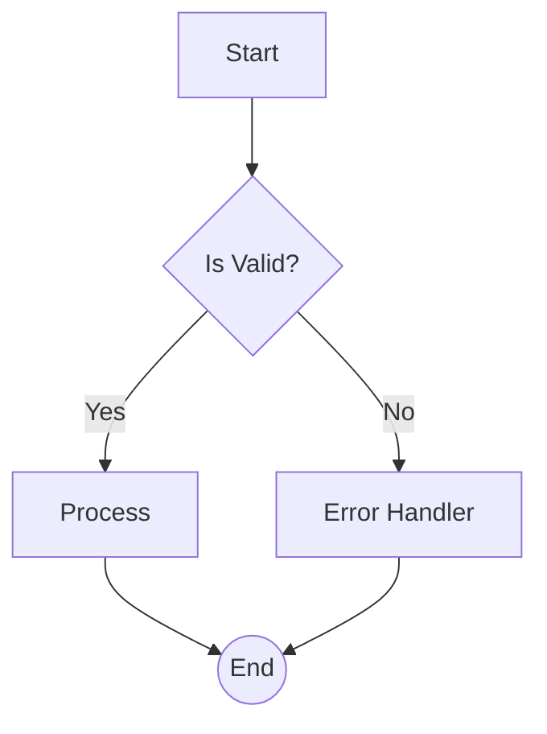
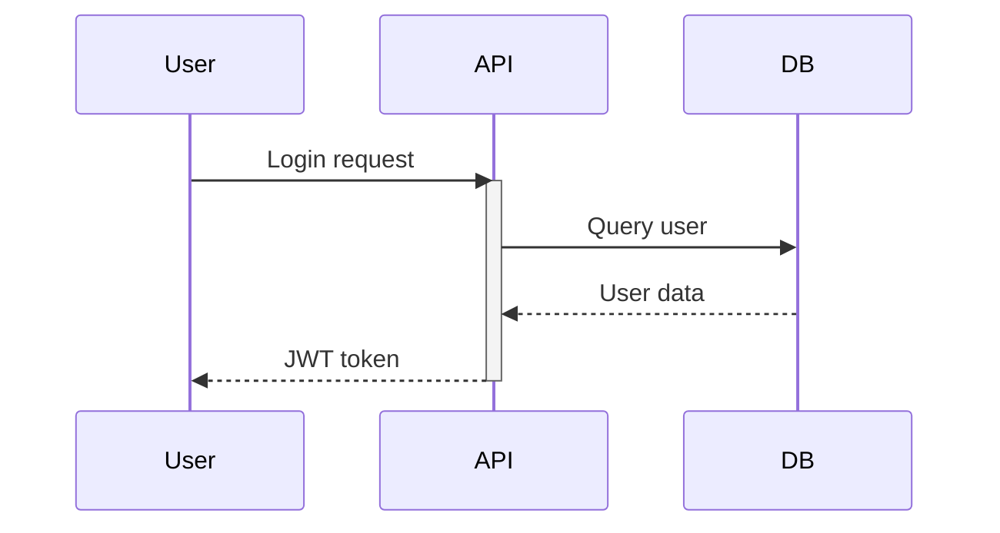
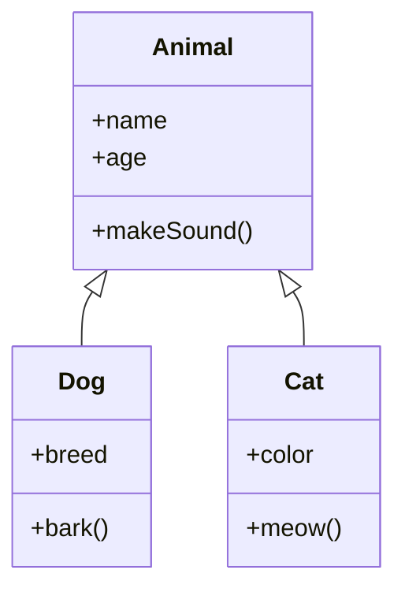
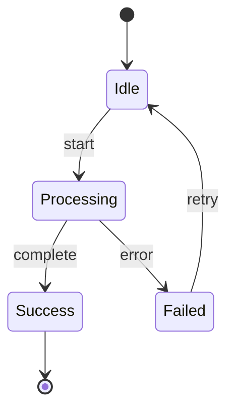
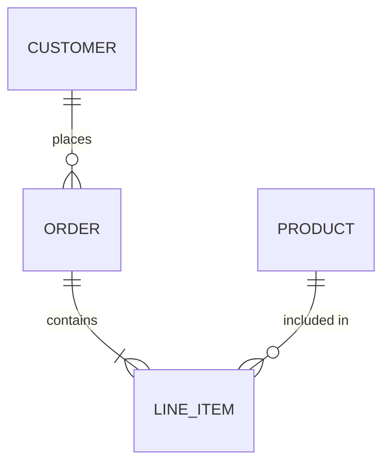
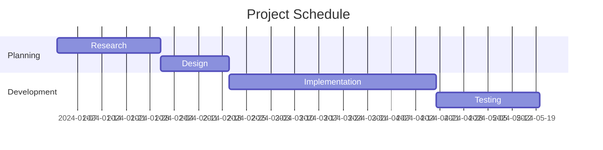
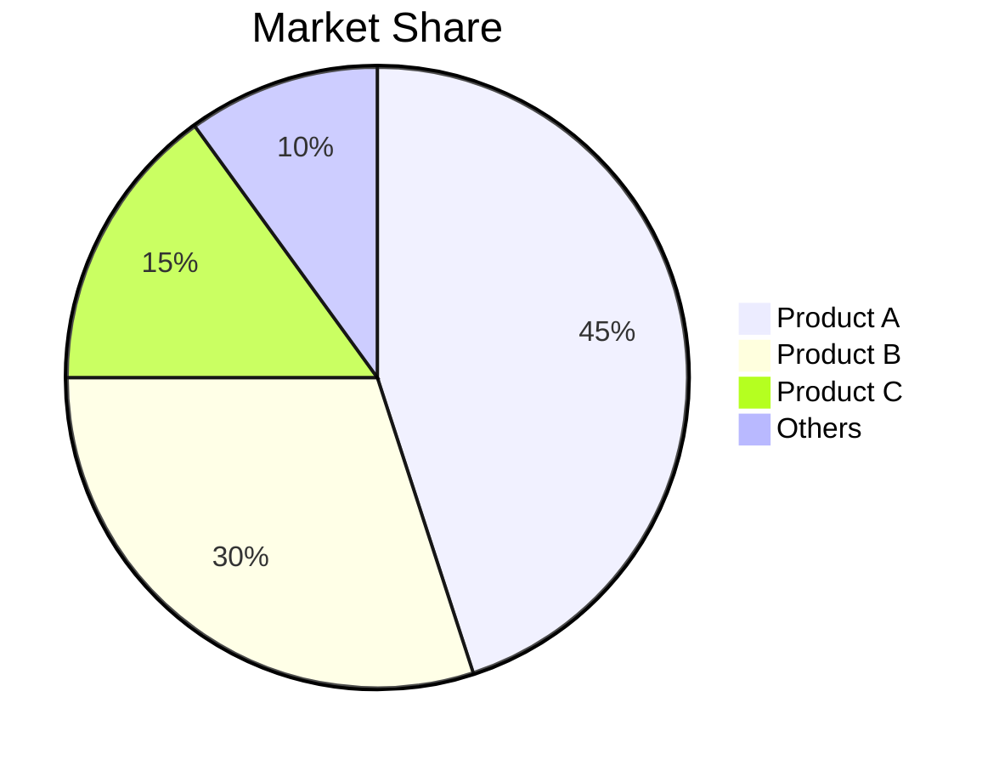
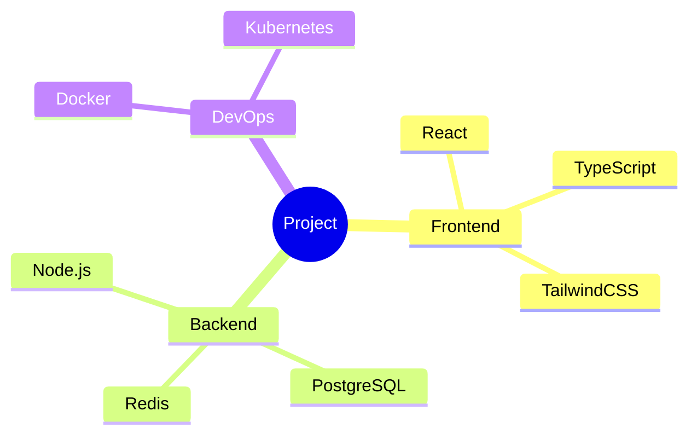
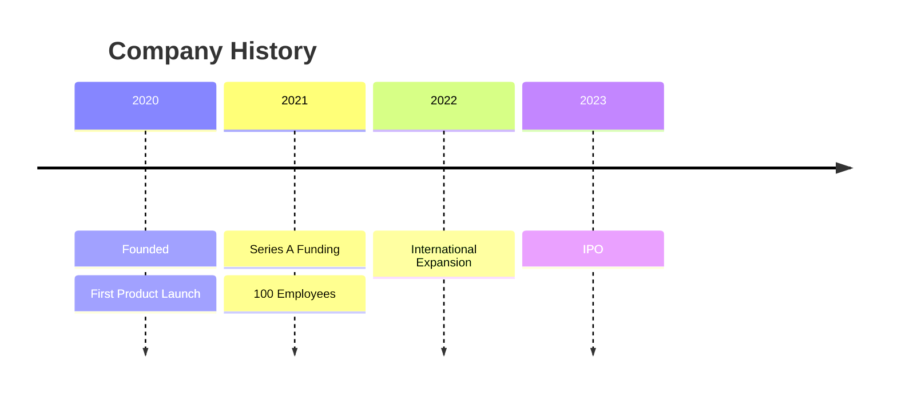
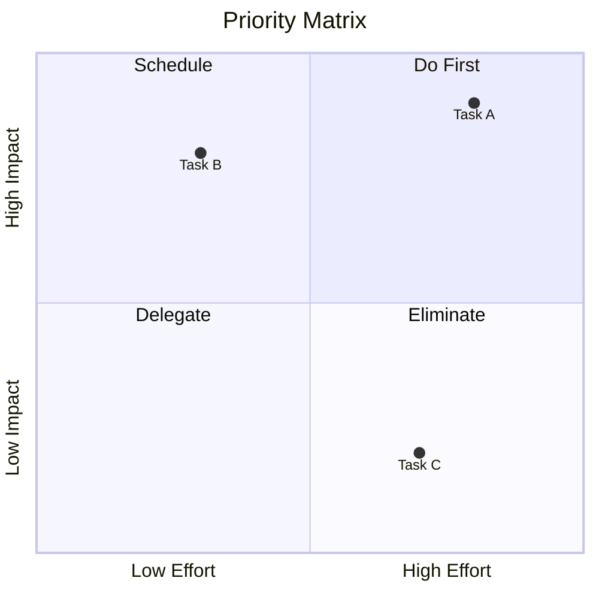

# Mermaid Syntax Conversion Patterns

This guide shows how to convert Mermaid diagram syntax into visual prompts for Go Bananas Pro model.

## Core Concept

Mermaid syntax defines structure. The visual prompt describes how that structure should look. The AI generates a beautiful visual representation.

```
Mermaid Syntax → Parse Structure → Build Visual Prompt → Generate Image
```

## Flow Diagrams (graph/flowchart)

### Direction Keywords

| Mermaid | Visual Description |
|---------|-------------------|
| `TD` / `TB` | "Top-to-bottom flow, starting at top" |
| `BT` | "Bottom-to-top flow, starting at bottom" |
| `LR` | "Left-to-right flow, horizontal layout" |
| `RL` | "Right-to-left flow, horizontal reversed" |

### Node Shapes

| Mermaid Syntax | Shape Name | Visual Description |
|----------------|------------|-------------------|
| `A[Text]` | Rectangle | "rectangular node with label 'Text'" |
| `A(Text)` | Rounded rectangle | "rounded rectangle node labeled 'Text'" |
| `A([Text])` | Stadium | "pill-shaped node containing 'Text'" |
| `A[[Text]]` | Subroutine | "double-bordered rectangle with 'Text'" |
| `A[(Text)]` | Cylinder | "database cylinder labeled 'Text'" |
| `A((Text))` | Circle | "circular node with 'Text' inside" |
| `A>Text]` | Asymmetric | "flag-shaped node pointing right" |
| `A{Text}` | Diamond | "diamond decision node labeled 'Text'" |
| `A{{Text}}` | Hexagon | "hexagonal node containing 'Text'" |
| `A[/Text/]` | Parallelogram | "parallelogram (input/output) with 'Text'" |
| `A[\Text\]` | Alt parallelogram | "reversed parallelogram with 'Text'" |
| `A[/Text\]` | Trapezoid | "trapezoid node labeled 'Text'" |
| `A[\Text/]` | Alt trapezoid | "inverted trapezoid with 'Text'" |

### Arrow Types

| Mermaid | Visual Description |
|---------|-------------------|
| `-->` | "solid arrow connecting" |
| `---` | "solid line without arrow" |
| `-.->`  | "dashed arrow connecting" |
| `-.->` | "dotted line with arrow" |
| `==>` | "thick/bold arrow connecting" |
| `--text-->` | "arrow labeled 'text'" |
| `-->|text|` | "arrow with 'text' label above" |

### Conversion Example

**Mermaid Input:**


**Visual Prompt:**
```
Create a professional flowchart with top-to-bottom flow:

NODES:
- Rectangular start node at top labeled "Start" (green fill)
- Diamond decision node below labeled "Is Valid?"
- Rectangular process node labeled "Process" (to the right of decision)
- Rectangular node labeled "Error Handler" (to the left of decision)
- Circular end node at bottom labeled "End" (red fill)

CONNECTIONS:
- Solid arrow from "Start" to "Is Valid?"
- Arrow labeled "Yes" from decision to "Process"
- Arrow labeled "No" from decision to "Error Handler"
- Both "Process" and "Error Handler" connect to "End"

STYLE: Clean corporate style, blue borders, white backgrounds, professional sans-serif font. Subtle drop shadows.
```

---

## Sequence Diagrams

### Elements

| Mermaid | Visual Description |
|---------|-------------------|
| `participant A` | "participant box labeled 'A' at top" |
| `actor A` | "stick figure labeled 'A'" |
| `A->>B: msg` | "solid arrow from A to B with message 'msg'" |
| `A-->>B: msg` | "dashed arrow from A to B with message 'msg'" |
| `A-xB: msg` | "arrow with X (lost message)" |
| `activate A` | "vertical bar showing A is active" |
| `Note right of A: text` | "note box to the right of A" |
| `rect rgb(...)` | "highlighted region/box" |
| `loop text` | "loop section labeled 'text'" |
| `alt text` | "alternative branch labeled 'text'" |

### Conversion Example

**Mermaid Input:**


**Visual Prompt:**
```
Create a sequence diagram showing API authentication flow:

PARTICIPANTS (left to right):
- "User" (stick figure icon)
- "API" (server icon, rectangular box)
- "DB" (database cylinder icon)

INTERACTIONS (top to bottom):
1. Solid arrow from User to API labeled "Login request"
2. API activates (show vertical blue bar on API lifeline)
3. Solid arrow from API to DB labeled "Query user"
4. Dashed return arrow from DB to API labeled "User data"
5. Dashed return arrow from API to User labeled "JWT token"
6. API deactivates

STYLE: Clean technical diagram, vertical lifelines extending down from each participant. Gray background for the sequence area. Professional monospace font for labels.
```

---

## Class Diagrams

### Elements

| Mermaid | Visual Description |
|---------|-------------------|
| `class ClassName` | "class box with name section" |
| `ClassName : +method()` | "method in class with + visibility" |
| `ClassName : -field` | "private field in class" |
| `A <|-- B` | "inheritance: B extends A" |
| `A *-- B` | "composition: A contains B" |
| `A o-- B` | "aggregation: A has B" |
| `A --> B` | "association: A uses B" |
| `A ..> B` | "dependency: A depends on B" |

### Conversion Example

**Mermaid Input:**


**Visual Prompt:**
```
Create a UML class diagram showing inheritance:

CLASSES:
- "Animal" class at top (parent):
  - Attributes: +name, +age
  - Methods: +makeSound()

- "Dog" class (bottom left, child of Animal):
  - Attributes: +breed
  - Methods: +bark()

- "Cat" class (bottom right, child of Animal):
  - Attributes: +color
  - Methods: +meow()

RELATIONSHIPS:
- Inheritance arrows (hollow triangles) from Dog to Animal
- Inheritance arrows (hollow triangles) from Cat to Animal

STYLE: UML standard notation, three-section boxes (name/attributes/methods), solid borders, white fill, inheritance arrows with hollow triangle heads.
```

---

## State Diagrams

### Elements

| Mermaid | Visual Description |
|---------|-------------------|
| `[*]` | "initial/final state (filled circle)" |
| `s1 --> s2` | "transition from s1 to s2" |
| `s1 --> s2 : event` | "transition triggered by event" |
| `state "desc" as s1` | "state with description" |
| `state s1 { }` | "composite state containing substates" |

### Conversion Example

**Mermaid Input:**


**Visual Prompt:**
```
Create a state machine diagram:

STATES:
- Initial state (small filled black circle)
- "Idle" state (rounded rectangle)
- "Processing" state (rounded rectangle, maybe with blue fill)
- "Success" state (rounded rectangle, green tint)
- "Failed" state (rounded rectangle, red tint)
- Final state (circle with inner filled circle)

TRANSITIONS:
- Initial → Idle (unlabeled)
- Idle → Processing labeled "start"
- Processing → Success labeled "complete"
- Processing → Failed labeled "error"
- Success → Final
- Failed → Idle labeled "retry" (curved arrow back)

STYLE: Rounded rectangles for states, arrows with labels above/below, clean layout with states spread out evenly.
```

---

## ER Diagrams

### Relationship Types

| Mermaid | Meaning | Visual |
|---------|---------|--------|
| `||--||` | one-to-one | "single lines both ends" |
| `||--o{` | one-to-many | "line to crow's foot" |
| `}o--o{` | many-to-many | "crow's feet both ends" |
| `||--o|` | one to zero-or-one | "line to open circle" |

### Conversion Example

**Mermaid Input:**


**Visual Prompt:**
```
Create an entity-relationship diagram:

ENTITIES:
- "CUSTOMER" table (rectangle with title bar)
- "ORDER" table (rectangle)
- "LINE_ITEM" table (rectangle)
- "PRODUCT" table (rectangle)

RELATIONSHIPS:
- CUSTOMER to ORDER: one-to-many (line to crow's foot), labeled "places"
- ORDER to LINE_ITEM: one-to-many, labeled "contains"
- PRODUCT to LINE_ITEM: one-to-many, labeled "included in"

STYLE: Database diagram notation, entities as rectangles with attribute sections, relationship lines with proper crow's foot notation, labels on relationships.
```

---

## Gantt Charts

### Conversion Pattern

**Mermaid Input:**


**Visual Prompt:**
```
Create a Gantt chart timeline:

TITLE: "Project Schedule"

SECTIONS:
Section 1: "Planning"
- "Research": Jan 1 - Jan 30 (blue bar)
- "Design": Jan 31 - Feb 20 (blue bar, starts after Research)

Section 2: "Development"
- "Implementation": Feb 21 - Apr 20 (green bar, 60 days)
- "Testing": Apr 21 - May 20 (orange bar, 30 days)

LAYOUT: Horizontal bars, date scale on top, section headers on left, today line if applicable.

STYLE: Professional project management style, distinct colors per section, grid lines for dates.
```

---

## Pie Charts

### Conversion Pattern

**Mermaid Input:**


**Visual Prompt:**
```
Create a pie chart showing market share:

TITLE: "Market Share"

SEGMENTS:
- "Product A": 45% (largest segment, blue)
- "Product B": 30% (second largest, green)
- "Product C": 15% (orange)
- "Others": 10% (gray)

STYLE: 3D effect optional, labels with percentages outside slices with leader lines, legend in bottom right, vibrant but professional colors.
```

---

## Mind Maps

### Conversion Pattern

**Mermaid Input:**


**Visual Prompt:**
```
Create a mind map visualization:

CENTER: "Project" (large central node)

BRANCHES:
Branch 1: "Frontend" (extends right)
  - Sub-items: React, TypeScript, TailwindCSS

Branch 2: "Backend" (extends down)
  - Sub-items: Node.js, PostgreSQL, Redis

Branch 3: "DevOps" (extends left)
  - Sub-items: Docker, Kubernetes

STYLE: Radial layout from center, organic curved branches, color-coded per main branch, decreasing node sizes for sub-items, clean readable labels.
```

---

## Timelines

### Conversion Pattern

**Mermaid Input:**


**Visual Prompt:**
```
Create a timeline infographic:

TITLE: "Company History"

EVENTS (left to right):
- 2020: "Founded" and "First Product Launch" (2 items)
- 2021: "Series A Funding" and "100 Employees" (2 items)
- 2022: "International Expansion"
- 2023: "IPO"

LAYOUT: Horizontal timeline with year markers, events above/below alternating, connection lines to timeline.

STYLE: Modern infographic, milestone markers (circles on line), clean typography, subtle gradient background.
```

---

## Quadrant Charts

### Conversion Pattern

**Mermaid Input:**


**Visual Prompt:**
```
Create a quadrant priority matrix:

TITLE: "Priority Matrix"

AXES:
- X-axis: "Low Effort" to "High Effort"
- Y-axis: "Low Impact" to "High Impact"

QUADRANTS:
- Top-Right (Q1): "Do First" (green background)
- Top-Left (Q2): "Schedule" (blue background)
- Bottom-Left (Q3): "Delegate" (yellow background)
- Bottom-Right (Q4): "Eliminate" (red/gray background)

ITEMS:
- "Task A" plotted at high effort, high impact
- "Task B" plotted at low effort, high impact
- "Task C" plotted at high effort, low impact

STYLE: 2x2 grid with axis labels, distinct quadrant colors (subtle), dot markers for items with labels.
```

---

## Git Graphs

### Conversion Pattern

**Mermaid Input:**
```mermaid
gitgraph
    commit
    commit
    branch develop
    checkout develop
    commit
    commit
    checkout main
    merge develop
    commit
```

**Visual Prompt:**
```
Create a git branch visualization:

BRANCHES:
- "main" branch (horizontal, primary line)
- "develop" branch (diverges down from main)

COMMITS:
- 2 commits on main
- Branch point: develop created
- 2 commits on develop
- Merge point: develop merged back to main
- 1 commit after merge

STYLE: Git visualization style, circles for commits, colored lines for branches (main=blue, develop=green), merge shown as lines converging.
```

---

## Universal Conversion Rules

1. **Always specify layout direction** - Don't assume, state explicitly
2. **Use quoted text for all labels** - Ensures exact text appears
3. **Describe visual hierarchy** - Which elements are more prominent
4. **Include relationship descriptions** - How elements connect
5. **Specify style at the end** - Colors, fonts, overall aesthetic
6. **Add context** - "for a technical presentation" changes the output

## Style Modifiers to Add

| Modifier | Effect |
|----------|--------|
| "professional" | Clean, corporate aesthetic |
| "hand-drawn" | Sketch-like, whiteboard style |
| "technical" | Engineering diagram look |
| "modern" | Flat design, bold colors |
| "minimal" | Lots of whitespace, simple |
| "colorful" | Vibrant, distinct colors |
| "monochrome" | Black and white only |
